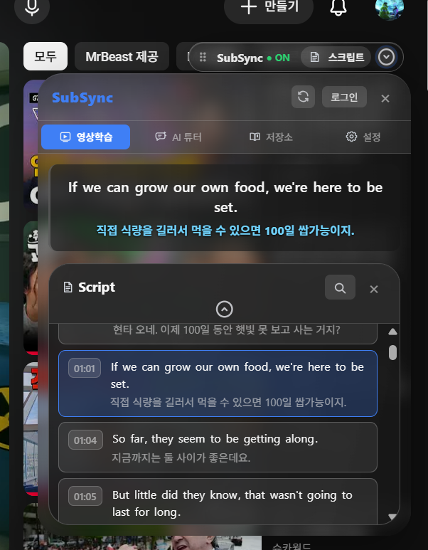
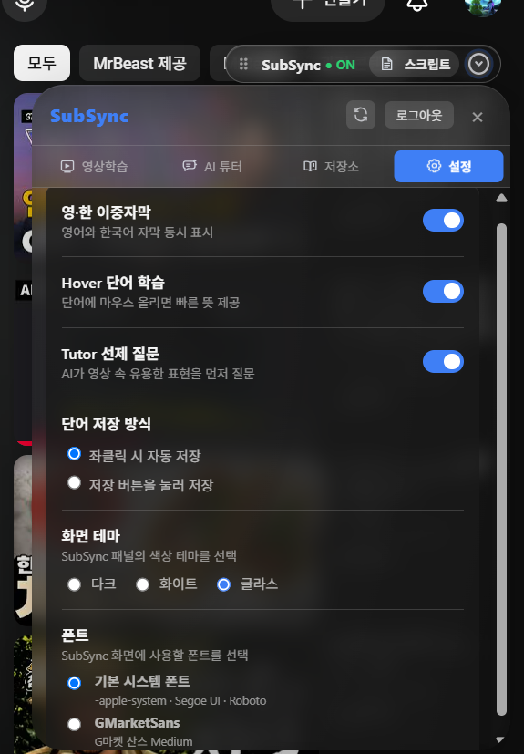

# SubSync 사용자 가이드

SubSync는 YouTube 영상을 시청하면서 영어와 한국어 자막을 함께 보고, 자막 속 단어를 학습하고, AI Tutor에게 영상 문맥을 질문할 수 있도록 돕는 Chrome 확장 프로그램입니다.

## 빠른 시작

1. [설치 가이드](INSTALLATION_GUIDE_KO.md)에 따라 SubSync를 설치합니다.
2. 자막이 있는 YouTube 영상을 엽니다.
3. `SubSync · ON` 퀵바가 표시되는지 확인합니다.
4. 영상학습 화면에서 영어·한국어 자막을 확인합니다.
5. 모르는 단어에 마우스를 올려 빠른 뜻을 확인합니다.
6. 단어를 클릭하여 상세 설명을 열고 저장합니다.
7. `스크립트` 버튼이나 패널을 사용하여 전체 자막을 탐색합니다.
8. 필요한 경우 `AI 튜터`에서 영상 내용에 관해 질문합니다.
9. 저장한 단어와 시청기록은 `저장소`에서 확인합니다.

> 화면과 메뉴 이름은 배포 버전에 따라 일부 변경될 수 있습니다. 아래 이미지는 SubSync의 기능 흐름을 설명하기 위한 참고 화면입니다.

## 1. 화면 구성

### 퀵바와 메인 패널

YouTube 영상 위에 표시되는 퀵바에는 다음 컨트롤이 있습니다.

- **SubSync · ON/OFF**: 확장 프로그램의 주요 학습 표시를 켜거나 끕니다.
- **스크립트**: 전체 자막 스크립트를 열거나 닫습니다.
- **패널 열기/닫기**: 메인 패널을 화면에 표시하거나 숨깁니다.
- **새로고침**: 현재 영상의 자막 정보를 다시 요청합니다.
- **로그인/로그아웃**: Google 계정 로그인 상태를 관리합니다.
- **×**: 메인 패널을 닫습니다.

패널의 헤더를 드래그하면 위치를 이동할 수 있습니다. 패널 헤더를 더블클릭하면 기본 위치로 돌아갑니다.

## 2. 영상학습

영상학습은 SubSync를 실행했을 때 기본으로 표시되는 화면입니다.

### 이중자막 보기

1. YouTube 영상 재생을 시작합니다.
2. 영상 위에 현재 문장의 영어 자막과 한국어 자막이 표시됩니다.
3. SubSync 패널의 자막 영역에서도 현재 문장을 확인할 수 있습니다.
4. 영상이 재생되면 현재 문장이 자동으로 바뀌고, 스크립트의 해당 문장이 강조됩니다.

한국어 자막을 사용할 수 없는 영상에서는 영어 자막만 표시되거나 자막 오류 안내가 표시될 수 있습니다.

### 단어 Hover 학습

영어 자막이나 스크립트의 단어에 마우스를 올리면 빠른 뜻 툴팁이 표시됩니다.

툴팁에서는 다음 정보를 확인할 수 있습니다.

- 선택한 영어 단어
- 간단한 뜻
- 저장 아이콘
- 상세 설명으로 이동하는 버튼

마우스를 다른 위치로 이동하면 툴팁이 닫힙니다. 설정에서 **Hover 단어 학습**을 끄면 이 기능을 비활성화할 수 있습니다.

### 단어 클릭과 상세 학습

1. 영어 자막 또는 스크립트에서 단어를 클릭합니다.
2. 상세 설명 팝업이 열릴 때까지 잠시 기다립니다.
3. 품사, 의미, 정의, 문맥 의미 및 관련 표현을 확인합니다.
4. **저장하기**를 선택하면 저장소에 단어를 추가합니다.
5. 이미 저장된 단어는 별표가 채워진 상태로 표시됩니다.
6. 다시 선택하면 저장을 취소할 수 있습니다.
7. 팝업의 `×` 또는 `Esc` 키로 상세 설명을 닫습니다.

사전 서버에 연결할 수 없으면 상세 설명을 불러오지 못했다는 안내가 표시될 수 있습니다.

## 3. Script

퀵바의 **스크립트** 버튼을 선택하면 영상의 전체 자막 목록을 확인할 수 있습니다.

각 스크립트 행에는 다음 항목이 표시됩니다.

- 자막 시작 시각
- 영어 문장
- 한국어 문장

### 스크립트 사용법

- **시간 버튼 선택**: 해당 문장 시점으로 영상을 이동하고 재생합니다.
- **검색 아이콘 선택**: 단어 또는 문장을 검색합니다.
- **접기 아이콘 선택**: 스크립트 목록을 접거나 펼칩니다.
- **× 선택**: 전체 스크립트를 닫습니다.
- **자동 강조**: 영상 재생 위치에 맞는 문장이 자동으로 강조됩니다.

스크립트가 로드되지 않으면 `자막 스크립트를 찾을 수 없습니다`와 같은 안내가 표시됩니다.

## 4. AI Tutor

AI Tutor는 현재 영상의 자막 문맥을 바탕으로 표현이나 내용을 질문하는 기능입니다.

### 질문하기

1. 메인 패널에서 **AI 튜터** 탭을 선택합니다.
2. 하단 입력창에 질문을 입력합니다.
3. **전송** 버튼을 선택하거나 입력창에서 Enter 키를 누릅니다.
4. 답변이 준비되는 동안 점 세 개 표시가 나타납니다.
5. 답변을 읽고 필요한 경우 추가 질문을 입력합니다.

질문에는 현재 영상 ID, 재생 시점 및 최근 자막 문맥이 사용될 수 있습니다. 따라서 AI Tutor를 사용할 때 개인정보나 비밀번호를 입력하지 않는 것을 권장합니다.

### 선제 질문

설정에서 **Tutor 선제 질문**을 켜면 영상 속 유용한 표현에 대해 Tutor가 먼저 질문할 수 있습니다. 선제 질문은 영상 재생 상태와 현재 자막 문맥에 따라 표시됩니다.

### 답변 피드백

Tutor 답변 아래의 버튼으로 답변 품질을 평가할 수 있습니다.

- `👍`: 답변이 도움이 된 경우
- `👎`: 답변이 아쉬웠던 경우

피드백을 전송한 뒤 `피드백이 반영되었습니다` 안내가 표시됩니다.

> AI 답변 품질과 응답 여부는 운영 백엔드, AI provider, 네트워크 및 사용량 제한에 따라 달라질 수 있습니다.

## 5. 저장소

저장소는 저장한 단어와 이 브라우저에서 누적된 시청기록을 확인하는 화면입니다. 화면을 열려면 메인 패널에서 **저장소** 탭을 선택합니다.

### 로그인

저장소를 확인하려면 로그인이 필요할 수 있습니다. 로그인하지 않은 상태에서는 로그인/회원가입 안내가 표시됩니다.

1. **로그인 / 회원가입** 또는 상단 **로그인**을 선택합니다.
2. 로그인 모달에서 Google 아이콘 버튼을 선택합니다.
3. Google 계정 인증을 완료합니다.
4. SubSync로 돌아온 후 저장소를 다시 엽니다.

### 단어 탭

단어 탭에는 저장한 단어가 최신순으로 표시됩니다.

각 카드에서 다음 내용을 확인할 수 있습니다.

- 저장한 영어 단어
- 단어의 뜻
- 단어가 사용된 문맥 문장
- 삭제 아이콘

삭제하려면 해당 카드의 휴지통 아이콘을 선택합니다. 삭제된 단어는 목록에서 즉시 사라집니다.

사전 또는 저장 API가 일시적으로 연결되지 않으면 브라우저 임시 저장으로 표시될 수 있습니다. 브라우저 저장공간을 삭제하면 임시 저장 단어도 사라질 수 있습니다.

### 시청기록 탭

시청기록 탭에는 이 브라우저에서 시청한 영상 기록이 표시됩니다.

각 영상 카드에는 다음 정보가 표시됩니다.

- 영상 썸네일
- 영상 제목
- 누적 시청 시간
- 마지막 시청 일시

썸네일이나 영상 제목을 선택하면 해당 YouTube 영상이 새 탭에서 열립니다.

시청기록은 영상이 재생 중일 때 일정 간격으로 누적됩니다. 일시정지 또는 영상 종료 상태에서는 시청 시간이 계속 증가하지 않습니다.

## 6. 설정

메인 패널에서 **설정** 탭을 선택하여 학습 환경을 조정할 수 있습니다. 설정은 Chrome 확장 프로그램 저장공간에 저장되어 이후에도 유지됩니다.

### 영·한 이중자막

영어와 한국어 자막의 동시 표시 여부를 설정합니다.

- 켜짐: 영어·한국어 자막을 함께 표시합니다.
- 꺼짐: SubSync의 이중자막 표시를 끕니다.

### Hover 단어 학습

영어 단어에 마우스를 올렸을 때 빠른 뜻 툴팁을 표시할지 설정합니다.

### Tutor 선제 질문

AI Tutor가 영상 속 표현을 바탕으로 먼저 질문할 수 있도록 설정합니다. 질문이 필요하지 않다면 끌 수 있습니다.

### 단어 저장 방식

화면에서 단어를 저장하는 방식을 선택합니다.

- **좌클릭 시 자동 저장**: 선택한 저장 동작에서 단어를 자동으로 저장하는 방식입니다.
- **저장 버튼을 눌러 저장**: 별표 또는 저장 버튼을 직접 선택했을 때 저장하는 방식입니다.

배포 버전에서 두 방식의 실제 동작은 출시 전 테스트를 통해 확인해야 합니다.

### 화면 테마

SubSync 패널의 외관을 선택합니다.

- **다크**: 어두운 배경의 기본 테마
- **화이트**: 밝은 배경의 테마
- **글라스**: 배경 영상이 은은하게 비치는 반투명 테마

### 폰트

- **기본 시스템 폰트**: 운영체제와 브라우저 환경에 맞는 폰트
- **GMarketSans**: SubSync에 포함된 Gmarket Sans Medium 폰트

Gmarket Sans와 Google 아이콘의 라이선스 및 출처는 [외부 리소스 고지](../THIRD_PARTY_NOTICES.md)를 확인합니다.

## 7. 로그인 및 로그아웃

### 로그인

1. 메인 패널의 **로그인**을 선택합니다.
2. Google 아이콘 버튼을 선택합니다.
3. Google 인증을 완료합니다.
4. 패널 상단 버튼이 **로그아웃**으로 변경되는지 확인합니다.

로그인 상태에서는 저장소와 계정 기반 기능을 사용할 수 있습니다.

### 로그아웃

1. 패널 상단의 **로그아웃**을 선택합니다.
2. 로그아웃이 완료되면 버튼이 **로그인**으로 변경됩니다.

로그아웃은 현재 확장 프로그램에 저장된 세션을 제거합니다. 로컬 단어·시청기록 삭제 여부는 배포 버전의 데이터 정책을 따릅니다.

## 8. 패널 이동 및 복귀

- 퀵바의 드래그 영역을 드래그하여 퀵바를 이동합니다.
- 메인 패널 헤더를 드래그하여 패널을 이동합니다.
- 영상 위 이중자막 영역을 드래그하여 자막 위치를 이동합니다.
- 메인 패널 헤더 또는 영상 자막을 더블클릭하면 기본 위치로 복귀합니다.
- 화면 가장자리 밖으로 완전히 벗어나지 않도록 위치가 제한됩니다.

## 9. 오류 및 제한사항

### 자막 관련

- 모든 YouTube 영상에 영어·한국어 자막이 있는 것은 아닙니다.
- 자막 트랙이 없거나 빈 응답이면 자막이 표시되지 않을 수 있습니다.
- YouTube의 일시적인 자막 요청 제한으로 재시도가 필요할 수 있습니다.

### AI Tutor 관련

- 답변은 현재 영상의 자막 문맥과 질문을 바탕으로 생성됩니다.
- 운영 백엔드 또는 AI provider가 중단되면 답변을 받을 수 없습니다.
- AI 답변은 학습 보조용이며 전문적인 번역·법률·의료·금융 판단을 대신하지 않습니다.

### 저장소 관련

- 로그인 및 운영 API 설정에 따라 단어 동기화가 제한될 수 있습니다.
- 브라우저 임시 저장 데이터는 브라우저 프로필, 확장 프로그램 삭제 또는 저장공간 초기화 시 사라질 수 있습니다.

## 10. 개인정보 보호

SubSync는 기능 제공을 위해 로그인 정보, AI Tutor 질문, 현재 영상 정보, 자막 텍스트, 설정 및 학습 상태를 처리할 수 있습니다. AI Tutor 사용 시 질문과 필요한 영상·자막 문맥이 외부 AI 서비스로 전송될 수 있습니다.

자세한 내용은 확장 프로그램에 포함된 [개인정보처리방침](../privacy.html)을 확인합니다.
